<!--
kanspec design v1 · 2026-08-30
Produced via multi-agent workflow: 3 research briefs (OpenSpec mechanics; prior art:
beads / Backlog.md / vibe-kanban / spec-kit / ADR tooling; agent-integration patterns)
-> 4 competing designs (git-native / board-first / review-centric / lifecycle)
-> 3 judge lenses (pain-point fidelity / agent ergonomics / feasibility) -> synthesis.
-->

# kanspec — final design

## Philosophy

kanspec is a single static binary that turns a `.kanspec/` directory of plain files — tickets, one-page proposals, living specs, decisions, quirks — into a live kanban board and review surface for coding agents, with every derived fact (merged-to-main, staleness, stuck-ness) computed from git rather than asserted by anyone. Agents interact only through a validated CLI; the human steers from a localhost board and per-item review pages; nothing an agent claims about merge state is ever stored, and nothing a proposal prescribed survives its close-out unless it is explicitly promoted into an auditable standing record. It is dramatically lighter than OpenSpec because the entire lifecycle lives in the binary as typed transitions with one-command fixes — not in prose procedures, folder conventions, or a delta-merge grammar.

**One-line pitch:** a kanban board and spec-review page over plain git-tracked files, where merge state, staleness, and "what rules steer my agents" are computed facts you glance at — never questions you ask a session.

---

## Architecture overview

**Components:**

1. **`kanspec` (alias `ks`)** — one static Rust binary. Every command works cold, takes `--json`, and validates transitions (illegal moves are typed errors, not warnings).
2. **The file store** — `.kanspec/` in the repo, git-tracked, one file per entity (ticket, decision, quirk, spec; one directory per proposal). Files are the only source of truth. IDs are 4-hex-char hashes (collision-free across parallel agents/worktrees); wherever a human reads one it wears a short title slug — `t-9c41-rate-limit-login` — that every verb ignores, the way a Reddit URL carries the post title (see *Readable ids* below).
3. **The server** — `kanspec up` runs the same binary as a loopback-only (127.0.0.1:5757), **stateless, foreground** process serving one embedded single-page app: the board, proposal review pages, decision pages, the rules page. It fs-watches `.kanspec/` and pushes SSE, and runs a merge-detection scan every 60s while up. Kill it and nothing is lost; the CLI never needs it.
4. **The cache** — `.kanspec/cache/` is gitignored and disposable: `gitstate.json` (last merge-detection results with method + timestamp) and an advisory lockfile. No SQLite in v0.1; glob-and-parse is fast at this scale.

**Daemon or not — resolved:** daemon-lite. A server exists because the one thing a static page cannot do is receive a comment POST, and the review round-trip must never depend on a human remembering to copy-paste. But it is a *view and a poller*, never a write authority: it is foreground by default (Ctrl-C to stop, `--detach` arrives in v0.3), holds zero private state, has no pid-discovery machinery, and there is exactly **one write path** — the CLI's internal write library, used identically by CLI commands and by the server's POST handlers, serialized by an advisory lock in `cache/`. The CLI never routes writes through the server; the server's fs-watcher picks up CLI writes and refreshes the browser. This eliminates the two-write-paths race class entirely.

**Storage choice — resolved:** per-entity markdown files with YAML frontmatter (never one shared JSONL for all tickets — cross-ticket merge conflicts must be structurally impossible, and a hot shared file whose integrity depends on per-clone merge-driver config is unacceptable). The two append-heavy sidecars (`comments.jsonl` per proposal) get `merge=union` in a committed `.gitattributes` — a **built-in** git strategy needing zero per-clone setup — plus id-dedupe on read. An optional field-level frontmatter merge driver ships in v0.2 as a nicety; without it you get ordinary conflict markers on the rare same-ticket edit.

**SQLite — resolved: client yes, storage no.** kanspec links SQLite (rusqlite, bundled) anyway to read homerunner's journal, so the dependency is already paid — but it stays a *client*. Entities never live in a database: SQLite's strengths (concurrent writers, transactions, indexes) solve problems kanspec deliberately doesn't have — one write path behind an advisory lock over a corpus small enough to glob-and-parse in milliseconds — while its weaknesses (binary, unmergeable, invisible in diffs and PRs) hit exactly what kanspec sells. Anything that must sync through git stays a file; beads' dual SQLite-cache-plus-JSONL-sync design is a standing example of the complexity that avoids. The one sanctioned use: if the derived-state cache ever outgrows JSON (thousands of tickets, slow scans), `cache/` swaps its internals to a gitignored SQLite file — an invisible change, since the cache is disposable and off-git by construction.

**Worktree unification (v0.1, mandatory):** every command resolves `git rev-parse --git-common-dir` and operates on the **primary worktree's** `.kanspec/`. All agents and worktrees on one machine share one board, one ready queue, one claim ledger — `start` is genuinely atomic across worktrees, and there is no per-branch board divergence. Cross-machine sync is ordinary git push/pull.

### Load-bearing invariants (resolved design decisions)

1. **Derived facts are never stored.** Merged-to-main lives only in `cache/gitstate.json`, written only by `kanspec scan`. No CLI command, UI action, or file field can set it. An agent physically cannot claim "merged."
2. **The merge badge never guesses.** Every badge shows detection method + `checked_at` freshness, and renders an explicit `unknown` state (e.g. squash merge, no `gh`) rather than a confident wrong answer.
3. **`kanspec rules` output is byte-identical to the standing-rules section of `kanspec prime`.** The audit surface *is* the injection surface — there is no second channel by which an old sign-off can steer agents.
4. **Closed proposals bind nothing.** Prime and rules draw only from standing records (specs, accepted decisions, active quirks) plus live work items. Close-out forces expire-or-promote on every proposal item.
5. **Item anchors are visible text** (`[c1]`, `[p1]`, `[auth.lockout]`), never invisible HTML comments an LLM must remember to preserve. Comments additionally store the item's quoted text, so threads survive edits and deletions land in a visible orphan tray — human feedback is never silently lost.
6. **One `.kanspec/` per machine** via git-common-dir resolution.
7. **Comments travel browser → localhost POST → in-repo JSONL → `--json` CLI read.** Never a clipboard hop; never server-only memory.
8. **Agents never self-accept standing rules.** Promotion mints a *proposed* decision; only the human accepts.
9. **Every anomaly names its one-command fix**, and the anomaly list is injected into agent sessions, so drift self-heals.
10. **Every state change appends to a per-ticket transition log with actor + verb**, and `kanspec doctor` replays that log against the transition table, so a state the trail does not reach fails CI. Be precise about what this buys, because the log is a plain text file anyone can edit and no claim beyond the following is being made:
    - **What is proven.** The trail is well-formed, in date order, legal at every step, and it ends at the state the frontmatter claims. `sed -i 's/state: review/state: done/'` leaves a trail that reaches `review`, so it is caught by the very next command and in CI.
    - **What is *detected*, not prevented, and how well.** A forger who edits the frontmatter *and* appends a matching log line produces a trail that replays perfectly. Nothing about the log itself can catch that — a `done` line proves only that a `done` line was written. `doctor`'s `unproven_close` therefore demands, of every `done` ticket naming a branch, head or PR, one of four corroborations, and fails CI without any: a ladder run that saw the work in main, the commit the gate recorded on the close, the durable `--no-code` waiver, or a `repair` attestation. Their strength is **not** equal, and the difference matters:
        - The **ladder verdict** lives in the gitignored cache and is recomputed from git. It cannot be forged by editing files in the repo, and it is the only corroboration that is genuinely outside the forger's reach.
        - The **recorded commit** and the **`--no-code` waiver** are plain text in the very log being edited, so a forger who copies their grammar from any real closed ticket produces them at will. Two consistency rules raise that cost without eliminating it: a recorded commit is disqualified when the ladder has already returned a *definitive* not-merged verdict for that ticket, and a waiver is disqualified when the trail carries a `ship` — a pair the gate itself would have refused. An `unknown` verdict deliberately disqualifies nothing, because an old close whose branch was deleted and garbage-collected reads unknown forever.
        - So the honest statement is: a careless forgery is caught, and a careful one — a copied note on a ticket git has never definitively answered "no" about — is not. This is detection with a floor, not proof.
    - **What is out of reach.** A hand-edit that also strips `branch:`, `head:` and `pr:` leaves git nothing to be asked about, and no corroboration check can speak. Detection here is a deterrent and an audit trail, never a transaction — see *Risks & honest weaknesses* 2.

    The single sanctioned exception is `kanspec repair` (see *Ticket lifecycle → Repairing a broken trail*): a recorded human attestation whose logged state is authoritative, so an imported or hand-broken repo is recoverable instead of permanently unwritable. It is bounded on both sides — it cannot attest a `done` the merge gate never granted, and every state it does attest stays visibly *attested* on `ls`, the board, `show` and `doctor` — so a vouched-for state never quietly ages into a proven one.

    Underneath all of it, invariant 1 holds unconditionally: **no amount of log or frontmatter forgery moves the merge badge**, because merged-to-main is computed from git and never read out of a file. The worst a forged close achieves is a ticket in the wrong column with a finding against it, never a "merged" this tool would repeat.

---

## Data model

```
.kanspec/
├── config.toml                     # main branch, port, gh mode, tripwire windows
├── tickets/
│   └── t-9c41.md                   # one ticket = one file; state in frontmatter, never folder
├── proposals/
│   ├── p-7de2-login-rate-limiting/
│   │   ├── proposal.md             # the entire proposal: one page
│   │   └── comments.jsonl          # append-only review ops log (merge=union)
│   └── closed/                     # moved here ONLY by `kanspec close` after the gate
│       └── p-19f0-money-as-cents/
├── specs/
│   ├── auth.md                     # living per-capability spec: frontmatter + rule bullets
│   └── payments.md
├── decisions/
│   └── D-8c1a.md                   # append/supersede only; immutable body once accepted
├── quirks/
│   └── q-11ba.md                   # one landmine = one file
└── cache/                          # GITIGNORED, disposable
    ├── gitstate.json               # merge detection results: {ticket, merged, sha, method, checked_at}
    └── lock

KANSPEC-FEATURES.md      # GENERATED to the repo root — team-facing feature map (committed)
KANSPEC-ARCHITECTURE.md  # GENERATED to the repo root — accepted decisions + scopes + provenance (committed)
```

ID prefixes: `t-` tickets, `p-` proposals, `D-` decisions, `q-` quirks, `cm-` comments. Spec rules use human-named bracket IDs (`[auth.lockout]`).

**Readable ids.** The four-hex key is right for merging and for citations; it is wrong as the thing a human reads. So every listing, status line, `rules`/`prime` provenance, board card and page shows a *label* — the key plus the first words of the title as a slug, `D-0174-dates-not-booleans`, `t-9c41-rate-limit-login` — and every verb accepts a label as the id: `kanspec show t-9c41-rate-limit-login` is `kanspec show t-9c41`. The slug is cosmetic, exactly like the title in a Reddit URL: nothing after the hex body is parsed, nothing is stored for it, and a title edit changes what you see without breaking anything you copied. Inside files the key stands alone — `deps:`, `source:`, ledgers, log lines, commit trailers and the `next` commands in `--json` all write `t-9c41` — so a citation never rots. Not sequential numbers, not slug-as-key, no slug lookup: `kanspec why dates` is not a thing, `kanspec why D-0174-dates` is. The label is a prefix of the branch (`ks/t-9c41-rate-limit-login…`) and proposal-directory names minted from the same title, so those parse as ids too.

### Ticket — `tickets/t-9c41.md`

```markdown
---
id: t-9c41
title: Rate-limit login endpoint
state: doing              # todo | doing | review | done | dropped
spec: auth
proposal: p-7de2
item: t1                  # which proposal ticket-item minted this
deps: [t-31aa]
followup_of: null            # leftover scope spawned by a closed ticket's triage
discovered_in: null       # tangential work found while doing another ticket
branch: ks/t-9c41-rate-limit-login
worktree: ../kanspec-wt/t-9c41
claimed_by: claude/sess-a91
pr: 142
head: null                # branch tip SHA, written by `kanspec ship`/`done` FROM GIT —
created: 2026-08-30T14:02:11Z   # never typed by an agent; survives branch deletion
---
Implement [auth.lockout]. Read q-83d0 before touching session middleware.

## Steps
- [x] lockout counter in Redis, sliding window
- [ ] 429 + Retry-After on lock
- [ ] test: two concurrent requests, same key

## Log
- 2026-08-30T14:02Z  todo   trevor           kanspec new
- 2026-08-30T14:20Z  doing  claude/sess-a91  kanspec start (branch + worktree created)
```

Note what is **absent**: any merged field. Merge state is cache-only. The `## Log` is append-only with actor + verb; `doctor` fails any state value not reached by a legal logged transition.

### Proposal — `proposals/p-7de2-login-rate-limiting/proposal.md`

```markdown
---
id: p-7de2
title: Login rate limiting
status: review            # draft | review | approved | closed | abandoned
specs: [auth]
approved: null            # stamped by `kanspec approve`: "2026-08-31T09:12Z trevor"
created: 2026-08-30
---
## Why
Credential stuffing hit staging; /login has no throttle.

## Changes
- [c1] auth: 5 failed logins in 10m locks the account 15m
- [c2] auth: lockout emits an `auth.lockout` event
- [c3] ops: alert when lockouts exceed 100/hour

## Prescriptions
- [p1] (promote: decision) Rate-limit state lives in Redis only — never Postgres.
- [p2] (temp until t-31aa) Keep the legacy captcha path until the lockout table ships.

## Tickets
- [t1] Rate-limit login endpoint · S · deps: t-31aa
- [t2] Lockout event + alert wiring · S
```

Every prescription is **typed**: `(temp until <ticket>)` dies when its guard ticket is detected on main; `(promote: decision|spec|quirk)` must become a standing record at close. Untyped prescriptions are a `doctor` warning and a close blocker. At close, a disposition ledger is stamped into frontmatter (see Provenance).

### Comment ops log — `comments.jsonl` (append-only, `merge=union`, id-dedupe on read)

```json
{"id":"cm-88f1","op":"comment","target":"p-7de2#c3","quote":"ops: alert when lockouts exceed 100/hour","body":"scope creep — split alerting into its own proposal","author":"trevor","at":"2026-08-30T16:02:00Z"}
{"id":"cm-88f1","op":"reply","by":"claude/sess-a91","via":"agent","body":"Agreed — moved to p-8a10; c3 removed.","at":"2026-08-30T16:21:40Z"}
{"id":"cm-88f1","op":"resolve","by":"claude/sess-a91","via":"agent","note":"c3 -> p-8a10","at":"2026-08-30T16:21:41Z"}
```

The `quote` field captures the item's text at comment time: threads are self-locating for agents (`{target, quote, body}` is the whole payload), "edited since — view diff" is detectable, and a deleted item moves its thread to a visible orphan tray instead of losing it.

### Spec — `specs/auth.md`

```markdown
---
feature: Login (JWT 24h), lockout after 5 failures, GitHub OAuth
code: [src/auth/**, src/middleware/session.ts]
---
# auth

## Rules
- [auth.jwt] Login issues a JWT valid 24h in an httpOnly cookie. {p-02cc}
- [auth.lockout] 5 failed logins within 10m locks the account for 15m. {p-7de2}
- [auth.lockout-event] Lockout emits an `auth.lockout` event. {p-7de2}
```

Plain prose bullets — no SHALL grammar, no scenario ceremony. Bracket IDs are stable merge keys and comment anchors; `{p-xxxx}` tokens are provenance back to the proposal that shipped each rule. The frontmatter `feature:` one-liner and `code:` globs feed the generated feature map and the staleness tripwire.

### Decision — `decisions/D-8c1a.md`

```markdown
---
id: D-8c1a
title: Rate-limit state lives in Redis only
status: accepted          # proposed | accepted | superseded | revoked
date: 2026-09-02
source: p-7de2#p1         # provenance: the exact proposal item that spawned this
scope: [src/auth/**]      # where it steers agents (prime injects full text on path match)
supersedes: null
superseded_by: null
---
## Context
Lockout counting needed shared state; Postgres fixed-window vs Redis sliding-window considered.
## Decision
Sliding window in Redis; keys `rl:login:<user>`, TTL 10m. No rate-limit state in Postgres.
## Consequences
Redis becomes availability-critical for login; add to runbook.
```

### Quirk — `quirks/q-11ba.md`

```markdown
---
id: q-11ba
title: Stripe webhooks replay in staging
paths: [src/billing/**]
severity: landmine        # landmine | gotcha | debt
status: active            # active | fixed | stale
source: t-8812            # the ticket where we learned this
fixed_by: null
---
Staging Stripe re-delivers events on redeploy; handlers MUST be idempotent or you
double-charge test accounts.
```

### Feature map — `KANSPEC-FEATURES.md` (generated to the repo root, committed)

```markdown
<!-- GENERATED by kanspec. Edit the sources (.kanspec/specs, .kanspec/decisions), not this file. -->
# Feature map

| Feature | Spec | Code | Last shipped change |
|---|---|---|---|
| Login, lockout, GitHub OAuth | auth | src/auth/** | p-7de2 |
| Stripe charges + smart retries | payments | src/payments/** | p-4c19 |

Staleness is computed from git at read time, not stored here: `kanspec features --stale`.
```

**A committed file is a pure function of the committed corpus.** Two things this mock-up
once carried are deliberately absent, for one reason: every byte here must be derivable
from the git-tracked sources of the *same commit*, so that two clones of one commit
regenerate identical bytes.

- **No `regenerated <date>` line.** `scan` runs from the `post-merge` and `post-checkout`
  hooks, so a timestamp would dirty the tree on every checkout — and a projection that does
  that is one a human deletes within a week.
- **No `Fresh?` column.** Staleness is computed from `.kanspec/cache/gitstate.json`, which
  `init` gitignores — so the same commit rendered `never scanned` on a fresh clone and `ok`
  once someone had run `scan`. Freshness is *live board furniture*, not a committed fact: it
  stays on `features`, the `spec show` footer, and the board's feature strip, each read at
  the moment it is printed.

---

## CLI reference

Every command: `--json`, typed errors that name the exact next command, color + aligned columns + one-glyph state badges (`○ todo ◐ doing ◈ review ⇂ in-main ● done ✕ dropped`).

```
SETUP
  kanspec init [--main <rev>]         scaffold .kanspec/, .gitattributes (merge=union), git hooks, gitignore cache/;
                                      --main names the branch tickets integrate through (default origin/main)
  kanspec setup claude|cursor|codex   install CLAUDE.md snippet + hooks (+ --remove to uninstall symmetrically)
  kanspec doctor [--fix]              prove invariants: log-trail legality, untyped prescriptions, dead globs,
                                      orphan deps, ledger completeness; exit 1 on violation (run in CI)
  kanspec instructions [topic]        print workflow docs (start|done|review|close) — docs ship in the binary

TICKETS
  kanspec new "title" [--spec S] [--proposal P] [--dep t-x] [--followup-of t-x] [--from t-x|--no-link]
  kanspec ready [--json]              claimable queue: todo + all deps done (derived)
  kanspec start <id> [--worktree]     atomic claim -> doing; creates branch ks/<id>-slug (+ worktree), logs it
  kanspec ship <id> [--pr N]          doing -> review; records head SHA from git + PR number
  kanspec done <id>                   close-out gate: requires git-detected merge (see lifecycle)
  kanspec park <id> --why "..."       doing -> todo; explicit unclaim so nothing rots silently
  kanspec drop <id> --why "..."       any -> dropped
  kanspec show <id> | kanspec log <id> | kanspec where     (`where` = which ticket owns this branch/worktree)
  kanspec ls [--spec S|--mine|--stalled|--unmerged|--all]
  kanspec repair <id> --why "..."     LAST RESORT: attest the state already in the file when its ## Log
                                      no longer replays (import, bad merge, hand-edit). Refuses to attest
                                      a `done` the merge gate never granted; what it attests stays badged

STATUS & GIT TRUTH
  kanspec status                      THE anti-stuck query: everything non-terminal grouped by who owes
                                      the next verb (YOU / AGENT / WATCHING), one-command fix per line
  kanspec scan [--explain] [--confirm <id>]   merge detection from git/gh; results -> cache only
  kanspec board [--export board.md]   terminal board; markdown snapshot for PRs
  kanspec ci [why t-x] [--json]       per-ticket CI state via homerunner (local) or gh; failure digests
  kanspec up [--port 5757]            serve live board + review pages (foreground, loopback, SSE)
  kanspec open                        open board in browser

PROPOSALS & REVIEW
  kanspec propose "title" [--spec S]  scaffold proposal.md (status draft), prints file path
  kanspec review p-7de2 [--export page.html]
                                      status -> review; prints review page URL; --export writes the
                                      page as one static, comment-less HTML file for reading elsewhere
  kanspec comments [p-x|t-x] [--unresolved --json]
  kanspec comment add|reply|resolve <target|cm-id> ...     (resolve requires --note)
  kanspec approve p-7de2              human act, recorded who/when; REFUSES with unresolved threads;
                                      mints [tN] items into linked board tickets
  kanspec close p-7de2                THE gate: refuses until every [cN]/[pN] item is dispositioned
  kanspec abandon p-7de2 --why "..."

PROVENANCE & DECISIONS
  kanspec rules [--path <file>] [--audit]    every standing rule steering agents now + provenance
  kanspec why auth#lockout            walk the chain: rule -> proposal item -> tickets -> PR
  kanspec promote p-7de2#p1 --as decision|spec|quirk [--scope glob]
  kanspec expire  p-7de2#p2 --reason "..."   (auto-suggested when a temp guard ticket lands)
  kanspec decide "title" [--from p-x#pN|t-x] [--scope glob]   mints a PROPOSED decision
  kanspec accept D-8c1a               human-only; freezes the body
  kanspec supersede D-8c1a --with "..." | kanspec revoke D-8c1a --why "..."

KNOWLEDGE
  kanspec features [--stale]          render the feature map; --stale lists tripwired specs
  kanspec spec show auth | kanspec spec grep "lockout"
  kanspec quirk add "..." --paths glob [--sev landmine] [--from t-x]
  kanspec quirk fix q-11ba --by t-x | kanspec quirks [--paths src/billing/**]
  kanspec prime [--json]              the agent working set (injected by hooks, ~1.5k tokens)
```

**Transcript — claiming work:**

```
$ kanspec start t-9c41 --worktree
  claimed  t-9c41-rate-limit-login  Rate-limit login endpoint          (logged: doing · claude/sess-a91)
  branch   ks/t-9c41-rate-limit-login    worktree ../kanspec-wt/t-9c41
  context  spec auth (3 rules) · 1 decision in scope (D-8c1a) · 2 quirks match paths (q-11ba, q-83d0)
  board    http://127.0.0.1:5757/t/t-9c41
```

**Transcript — the anti-stuck query:**

```
$ kanspec status
 YOU (3)
  ◈ p-7de2-rate-limiting          3 unresolved review threads await you        → http://127.0.0.1:5757/p/p-7de2
  ⇂ t-31aa-lockout-table          in main 2h (gh-pr #142 · checked 4m ago), not closed  → kanspec done t-31aa
  ● p-19f0-captcha-retirement     settling: last ticket landed, 2 items undispositioned → kanspec close p-19f0
 AGENT (2)
  ○ t-66d1-rate-limit-login       ready · auth · unblocked when t-31aa-lockout-table closed
  ◈ p-7de2-rate-limiting          1 answered thread awaits your resolve        → kanspec comments p-7de2 --unresolved
 WATCHING (2)
  ◐ t-88fe-session-rotation       STALLED: doing, no commits or updates for 3h → kanspec park t-88fe --why "..."
  ⚠ payments                      4 merges touched src/payments/** since spec last edited → kanspec features --stale
```

**Transcript — closing a ticket:**

```
$ kanspec done t-9c41
✓ merged verified: a1b9c3d reachable from origin/main (method: gh-pr #142 · checked 11s ago)
Leftover triage — 1 unchecked step:
  [ ] "test: two concurrent requests, same key"
  [s]pawn ticket / [d]rop with reason / [x] actually done: s
  ✓ spawned t-c412 "test concurrent same-key requests" (followup_of t-9c41)
Knowledge check — branch touched src/auth/** (spec: auth): spec edited on this branch ✓
Quirks discovered? [enter = none]:
● t-9c41-rate-limit-login  done · p-7de2-rate-limiting is settling (last ticket landed) → kanspec close p-7de2
```

Non-interactive/agent form (required flags, no silent defaults): `kanspec done t-9c41 --json --spawn "test concurrent same-key requests" --no-quirks` — and `--no-followups` must be passed explicitly when there are none, so "no leftover work" is a recorded claim, never an omission.

---

## Agent contract

**Discovery:** `kanspec setup claude` installs everything below. Permanent context cost is ~10 lines; long-form docs live behind `kanspec instructions` and version with the binary (they never rot in CLAUDE.md).

**Exact CLAUDE.md snippet installed:**

```markdown
## kanspec
This repo tracks work, specs, and standing rules with kanspec. `kanspec prime` is auto-injected
at session start; run it yourself if context feels missing.
- Find work: `kanspec ready --json`. Claim before coding: `kanspec start <id>` (creates branch/worktree).
- Diff ready: `kanspec ship <id> --pr <n>`. Finish: `kanspec done <id>` — it will gate you; answer its flags.
- Never state whether something is merged. Merge state is git-detected; report `kanspec show <id>` output.
- Unsure what you owe, or whether you are stuck: `kanspec status` — every line names its own fix.
- Standing rules are `kanspec rules` output ONLY. Closed proposals bind nothing — never read
  .kanspec/proposals/closed/. Never edit an accepted decision; propose one with `kanspec decide`.
- Out-of-scope work you uncover (>5 min): `kanspec new "..."` — one command; it auto-links
  discovered_in to your claimed ticket. Park it and keep going; do NOT expand your current ticket.
  Gotcha learned the hard way: `kanspec quirk add "..." --paths <glob>`.
- Change state ONLY via kanspec verbs — never hand-edit frontmatter. Workflow details: `kanspec instructions`.
```

> **Every line here must be a command v0.1 actually ships.** This block once prescribed
> `kanspec comments --unresolved --json` and `kanspec comment resolve <cm-id>`; both are
> v0.2, `#[command(hide = true)]`, and exit 1 — so every agent that followed the contract
> hit a refusal on it and learned to distrust the whole block. A contract is only worth its
> most-obeyed line. The review pair returns here when `comments`/`comment` ship;
> `setup.rs::the_snippet_only_prescribes_commands_the_binary_actually_has` walks the clap
> tree and fails the build if a hidden or non-existent verb creeps back in.

**Hooks installed:**

| Hook | Command | Purpose |
|---|---|---|
| `SessionStart` | `kanspec prime` | inject ~1.5k tokens of live state (below) |
| `PreCompact` | `kanspec prime` | re-inject after compaction — the moment prompt-carried behavior dies |
| `PostToolUse` (Edit/Write) | `kanspec quirks --touch <file>` | if the written file matches an active quirk's paths and it wasn't yet surfaced this session, emit a one-line warning — the landmine warning fires at the moment of touching the landmine |
| `Stop` (installed, config-gated) | `kanspec landcheck` | exit 2 with the exact verb to run if: committed diff exists but the claimed ticket had no update this session; unresolved comments target a proposal this session edited; or `done` skipped the knowledge check. Exit 0 once clean — no loops |
| git `post-merge` / `post-checkout` | `kanspec scan --quiet` | merge badges stay fresh with zero agent involvement |
| git `prepare-commit-msg` + `commit-msg` (dispatching on `branch.<name>.kanspec-ticket`, set by `start`) | append `Kanspec: t-9c41` trailer | a squash-surviving merge-detection signal. **Both, not one:** `prepare-commit-msg` runs before the editor, so on an interactive commit the message is still empty and stamping it would make it non-empty — destroying git's "an empty message aborts the commit". `prepare-commit-msg` stamps only a message that already has content (`-m`/`-F`/`-t`); `commit-msg`, which runs after the editor, stamps the rest. Neither stamps twice, a merge or a squash, or below a `git commit -v` scissors line |

**`kanspec prime` payload (~1.5k tokens):** (1) the standing-rules section — **byte-identical to `kanspec rules`**: accepted decisions with scope matching the branch's touched paths in full text, others as one-liners; active quirks matching those paths; the spec rules for touched capabilities, **ranked and budgeted** — the spec whose glob names the file first, then the one covering most of the touched paths, shown in that order while `[prime] spec_budget_tokens` (default 2 000) is unspent and *named* past it (`assets — 19 rules not shown … → kanspec spec show assets`), so a wide branch on a 666-rule corpus injects ~2.5k tokens instead of ~14k and nothing is hidden silently; (2) the live slice: my claimed ticket + unresolved comment count, ready-queue top 5, and the `kanspec status` anomaly lines. Path-scoped injection is the context-economy answer: an agent in `src/auth/` never pays for the billing quirks. The budget lives in the generator, so `rules --path` elides identically; `rules --full` lifts it for the human checking.

**The precise mechanism that keeps the board truthful without nagging** — five gears, none of which is "please remember":

1. **Validated single write path.** State transitions exist only as CLI verbs with typed rules; every transition appends actor + verb to the ticket Log; `doctor` (CI) proves every state was legally reached — a hand-edit has no log entry and fails.
2. **No write path at all for the facts agents get wrong.** Merged state is computed by `scan` into the gitignored cache; `head:` SHAs are read from git by the CLI, never typed.
3. **State-in-prompt.** Prime injects the live board slice and status anomalies at session start and after compaction — agents update the thing they can see, and every anomaly line carries its fix command.
4. **Exit gates.** `done` refuses without merge detection and without an explicit followups answer; `landcheck` blocks session end while the tracker disagrees with the working tree.
5. **Automatic anomaly detection.** STALLED flags (doing, no commits/updates for the configured window, default 2h), dwell tripwires (review > 7d, in-main-but-not-closed > 1d, settling > 3d), and the spec staleness tripwire all surface in `status` without anyone noticing anything.

---

## The board

`kanspec up` binds 127.0.0.1:5757 and serves one embedded single-page app (vanilla JS, no build step) fed by a JSON endpoint + SSE; the fs-watcher makes CLI, agent, and browser edits appear within a frame. It runs `scan` every 60s, so the In-main column populates itself while you watch. Cold fallback: `kanspec board` renders the same data in the terminal with the cached git state and its age; `kanspec board --export board.md` writes a snapshot for PRs.

**Columns** (the board *is* the state machine; dragging a card invokes the corresponding verb, and illegal moves bounce with the typed reason):

```
BACKLOG        READY          DOING              REVIEW             IN MAIN ⇂           DONE (7d)
t-66d1         t-9d02         t-9c41             t-88fe             t-31aa              t-8812
blocked by     alert wiring   rate-limit login   session rotation   lockout table       webhook fix
t-31aa         auth           auth · p-7de2      auth               auth
               S              ⎇ ks/t-9c41-...    ⎇ ks/t-88fe-...    gh-pr #142 · 2h ago
                              ⌂ ../wt/t-9c41     PR #143 open       checked 40s ago
                              claude/sess-a91    2 threads open     → close me
                              14m ago            STALLED 3h
```

- **Backlog/Ready** are derived from the dependency graph (todo with/without open deps). **In main** is a derived overlay: doing/review tickets whose commits are detected on `origin/main` — awaiting `kanspec done`. **Done** means closed out *and* verified landed (or an explicit recorded `--no-code`).
- **Every card:** id, title, spec chip, proposal chip, `⎇ branch`, `⌂ worktree` path, claiming agent, minutes since last update, unresolved-comment count, and the merge badge — always one of `unpushed / pushed / PR #142 open / IN MAIN (method · checked_at) / unknown (why)`. Never a guess.
- **STALLED** renders automatically on abandoned doing cards.
- **Tabs:** **All tasks** · **By spec** (swimlane per capability plus an "unspecced" shame lane) · **Worktrees** (one row per active branch/worktree: agent, ticket, last commit age, ahead/behind main, merge state — the many-agents-at-a-glance view) · **Review queue** (proposals in review + tickets in review, unresolved counts) · **Rules** (the `kanspec rules` page with revoke/supersede buttons) · **Proposals**.
- **Pinned strips on every tab:** the `kanspec status` attention list at top; the feature map with staleness dots at bottom.

---

## Spec proposals & review loop

**Format:** one page, five sections — Why (2–4 sentences), Changes (`[cN]` bullets), Testing and verification (how anyone will know it works), Prescriptions (`[pN]`, typed — the rules the proposal leaves behind; the page labels them that way), Tickets (`[tN]`, minted at approve). The first sentence of every bullet is its headline: the review page shows that line and folds the rest, so a plan reads in a dozen lines. Author-added sections are passed through to the page in file order. No design.md, no tasks.md, no delta-spec files, no SHALL grammar. A one-line tweak is a five-line proposal. Item IDs are visible text and are the comment anchors and disposition keys.

**Lifecycle:** `draft → review → approved → closed` (or `abandoned`). "Settling" is a derived flag: the moment scan/done detects the last linked ticket terminal, the proposal surfaces in `status` and on the board as *settling — close me*, so close-out is prompted, never remembered.

**The review page** (`kanspec review p-7de2` prints the URL): the proposal typeset properly — typographic hierarchy, prescriptions as `TEMP` / `PROMOTE → decision` badges, tickets as linked cards — and under each Changes bullet, the **current spec text inlined in a collapsible context block**, so the human reviews the delta against today's truth without opening files. Clicking any `[cN]`/`[pN]`/`[tN]` opens a threaded comment in a right-hand rail, Google-Docs style. Resolved threads collapse green with their resolution notes. Items edited since a comment show "edited since — view diff" using the stored quote; items deleted move their threads to a visible **Orphaned** tray.

**Comment round-trip, end to end:**

1. Human clicks `[c3]`, types a comment → browser POSTs to the server → server appends one line to `comments.jsonl` via the same write library as the CLI. Truth is the repo; the page is a pure view; there is nothing else to sync.
2. The unresolved count rides in `prime` and in `status`, so feedback is un-ignorable work, not scrollback. The human can also just say "address review on p-7de2."
3. Agent: `kanspec comments p-7de2 --unresolved --json` → `{target, quote, body}` triples, self-locating with zero page context. It edits `proposal.md` (visible IDs survive rewrites; `doctor` flags any dropped ID *without* reminting — threads re-attach when the ID returns, or orphan visibly), replies with `kanspec comment reply`, resolves with `kanspec comment resolve --note "..."`.
4. SSE refreshes the human's open page mid-conversation. Iteration is live: comment → agent edit → re-review → repeat.
5. `kanspec approve` ends it: **refuses while unresolved threads exist** (the human resolving one themselves is the recorded waiver), stamps who/when into frontmatter, and mints the `[tN]` items into linked board tickets. Approval is an explicit recorded act, never implicit.

**When specs change:** as part of implementation. The ticket that implements `[c1]` edits `specs/auth.md` on its branch — adding/changing the `[auth.lockout]` rule bullet with its `{p-7de2}` token — and that edit is reviewed in the PR like any code. Specs update when reality updates: no archive-time merge, no deferred delta debt, no bot commits to trunk, and the spec can never say something main doesn't do for longer than a PR review.

---

## Decisions registry

Format: MADR-minimal (Context / Decision / Consequences, one page max) with `status`, `scope` globs, and `source` provenance — example above. Lifecycle, CLI-enforced:

```
proposed ──accept (human only)──▶ accepted ──▶ superseded | revoked
```

Accepted bodies are **immutable**: the only legal mutations are status flips and back-links. `kanspec supersede` creates the new record and flips the old with bidirectional links; `kanspec revoke --why` is the human's kill switch. `doctor` fails the repo if an accepted decision's body changed in git without a status change.

**How agents read:** (1) `prime` auto-injects full text of accepted decisions whose `scope` matches the branch's touched files, one-liners for the rest; (2) `kanspec rules --path <file>` for an explicit pre-flight check; (3) plain greppable markdown as fallback.

**Update triggers — agents write decisions at exactly three moments, and never self-accept:**
1. **Promotion at proposal close** (the main path): `kanspec promote p-7de2#p1 --as decision` mints a *proposed* decision with `source:` pre-filled; the human accepts it on its own review page (a one-item review with the same comment machinery).
2. **Mid-implementation discovery:** `kanspec decide "..." --from t-9c41` when a real architectural call gets made outside a proposal — the `done` ritual asks "any decisions made this ticket?" so capture happens at the moment ADR practice historically loses it. Still lands as *proposed*.
3. **Superseding**, same propose-then-human-accept rule.

Proposed decisions are **not** injected as standing rules; a pending one sits in the YOU section of `status` until accepted or dropped — visible, never silently binding.

---

## Project knowledge layer

**Feature map & architecture = generated projections, published where the team looks.** `KANSPEC-FEATURES.md` regenerates at the **repo root** (the `KANSPEC-` prefix keeps the names collision-free in repos that already have their own feature or architecture docs, and groups the generated pair in listings; rename via `[paths]` — plain `FEATURES.md` if it's free — and `init` refuses to claim any path that already exists un-generated) from `specs/*` frontmatter (`feature:` one-liner + `code:` globs) plus the last proposal that shipped a change to each spec. `KANSPEC-ARCHITECTURE.md` regenerates beside it from the decisions registry: accepted decisions with scopes and provenance links, plus active landmine-grade quirks. Projections cannot rot independently of their sources — which is exactly why they're safe to put in plain sight: a teammate browsing GitHub reads current truth without knowing kanspec exists, and a "GENERATED — edit via kanspec" header stops hand-edits. The map goes stale only if a spec goes stale, and spec staleness is mechanically detected. Agents still get the same content compactly in `prime` (~30 tokens per feature); humans also see it as the board's bottom strip with staleness dots.

**Deferred:** moving the *sources* (`specs/`, `decisions/`) out of `.kanspec/` into a visible directory. The projections likely make it moot — humans meet specs through the board, the review pages, and PR diffs, and now meet the summaries at the repo root. If real use says otherwise, a `[paths] knowledge` knob relocating the source tree is a small, contained change; revisit after v0.1 dogfooding.

**Quirks** are one file each with `paths` globs (format above). Consumed path-scoped: `prime` injects quirks matching the ticket's likely scope; the **PostToolUse hook re-warns at the moment an agent writes a matching file** — the instant that actually prevents stepped-on landmines. Retired only by evidence: `kanspec quirk fix q-11ba --by t-x`.

**The anti-rot mechanism — three interlocking gears (structural, not aspirational):**

1. **The staleness tripwire (detection).** `scan` diffs each merged ticket's changed paths against every spec's `code:` globs. A spec whose globs accumulated N merges (default 3) with zero spec edits raises a `status` line — "payments: 4 merges since last spec edit — stale spec or missing globs?" — with a one-key resolution: spawn a doc ticket, or confirm no behavior change (logged; counter resets). Staleness is a git fact, like merge state.
2. **The done checkpoint (forced but visibly skippable).** `kanspec done` maps the branch diff to spec globs and quirk paths: if a matching spec wasn't edited on the branch, it requires either the edit or an explicit `--spec-unchanged "<spec>:<reason>"` per uncovered spec — each named on its own line with the glob that caught it, never one blanket answer for several — recorded on the ticket and visible on the board. Skippable, but every skip is an auditable act, and the Stop hook blocks a session that dodged the check entirely.
3. **One-line capture at the moment of pain.** `kanspec quirk add "..." --paths glob` is a single command; the done ritual's one-key "quirks discovered?" prompt fires while the burn is fresh. Capture friction near zero is why this registry accretes where ADR-era logs died.

Residual drift is `doctor`'s job: globs matching zero files (dead quirk / renamed directory), decision scopes matching nothing, spec `code:` entries pointing at deleted paths — amber dots on the board's feature strip, hard failures in CI if you want them.

---

## Provenance & proposal end-of-life

The stale-consent failure — an old accepted mega-proposal silently steering later work — is impossible by construction, via three rules:

**Rule 1 — closed proposals bind nothing.** `prime`/`rules` draw only from standing records (specs, accepted decisions, active quirks) plus live work items. `kanspec close` sets `status: closed` *and* moves the directory to `proposals/closed/` (both, atomically; `doctor` verifies they agree), and the agent snippet says it in one line: *closed proposals bind nothing — never read `proposals/closed/`.* There is no code path by which closed prose reaches a future session.

**Rule 2 — expire-or-promote, mechanically gated.** `kanspec close p-7de2` enumerates every `[cN]` and `[pN]` item and refuses to close until each has a disposition, printing the exact command per unmet item:

```
$ kanspec close p-7de2
✗ cannot close p-7de2 — 2 items undispositioned:
  [c3] "ops: alert when lockouts > 100/hr" — not found in any spec
       → kanspec close p-7de2 --followup c3   |   --dropped c3 --note "..."
  [p1] (promote: decision) "rate-limit state in Redis only"
       → kanspec promote p-7de2#p1 --as decision --scope "src/auth/**"
  [p2] (temp until t-31aa) — t-31aa landed ✓ → will auto-expire at close

$ kanspec promote p-7de2#p1 --as decision --scope "src/auth/**"
  ▸ D-8c1a created (proposed) · source p-7de2#p1 · accept: http://127.0.0.1:5757/d/D-8c1a
$ kanspec close p-7de2 --followup c3
  ✓ t-9d02 spawned from c3
  ✓ p-7de2 closed · ledger: c1 shipped→auth#lockout · c2 shipped→auth#lockout-event ·
    c3 followup→t-9d02 · p1 promoted→D-8c1a (awaiting accept) · p2 expired (t-31aa landed)
```

Dispositions: `shipped → spec#rule` (auto-detected via the `{p-xxxx}` token), `promoted → D-x | q-x`, `followup → t-x`, `dropped (note)`, `expired (reason)`. Typed prescriptions do most of the work themselves: `(temp until t-x)` becomes auto-expirable the moment merge detection sees its guard ticket land — provenance wired to git truth, not memory — and shipped Changes are auto-recognized from spec tokens, so a typical close is one or two keys, not twelve. The ledger is stamped into the closed proposal's frontmatter: leftover work became visible board tickets; standing rules became auditable records; everything else demonstrably died.

**Rule 3 — every standing record points home.** Decisions carry `source: p-x#pN`; spec rules carry `{p-x}` tokens; quirks carry `source: t-x`. Links run from standing record to origin, so auditing never requires reading old proposals, and revoking is a one-file, reviewable git diff.

**The audit answer is one command (and the board's Rules tab):**

```
$ kanspec rules
STANDING RULES steering agents now (= byte-identical to the rules section of `kanspec prime`)
 DECISIONS (3)
  D-8c1a  Rate-limit state in Redis only     ← p-7de2#p1   scope src/auth/**      accepted 2026-09-02
  D-2c77  Money amounts are integer cents    ← p-19f0#p2   scope src/billing/**   accepted 2026-06-11
 QUIRKS (4, injected by path match)
  q-11ba  Stripe webhooks replay in staging  ← t-8812      paths src/billing/**   landmine
 SPEC RULES: 41 across 6 capabilities (each carries its {p-xxxx} source token; `kanspec why <anchor>`)
Nothing outside this list is served to agents. Closed proposals bind nothing.

$ kanspec rules --audit
 ⚠ D-2c77: source proposal p-19f0 is closed; accepted 81d ago; 0 references from open tickets or shipped rules — still wanted?
 ⚠ spec auth [auth.oauth]: no provenance token (pre-kanspec) — adopt with `kanspec rules --adopt` or delete
```

Because `rules` and the standing section of `prime` share one generator, *what the human audits is byte-identical to what agents are steered by*. `kanspec why auth#lockout` walks the full chain: rule → proposal item → tickets → PR.

---

## Ticket lifecycle

```mermaid
stateDiagram-v2
    [*] --> todo: new · close-spawn · approve mints [tN]
    todo --> doing: start (atomic claim; branch + worktree; logged)
    doing --> todo: park --why
    doing --> review: ship (head SHA + PR recorded from git)
    review --> doing: start (rework)
    review --> done: done — REQUIRES git-detected merge
    doing --> done: done --no-code --why (chore/docs; recorded)
    todo --> dropped: drop --why
    doing --> dropped: drop --why
    review --> dropped: drop --why
    done --> [*]
    dropped --> [*]

    note right of review
      scan overlays IN MAIN when commits are
      detected on origin/main (cache-only fact,
      single writer, never stored in the ticket)
    end note

    note left of todo
      repair --why is a self-loop on every state:
      it moves nothing, it records that a human
      vouched for the state already in the file.
      It cannot attest `done` without a logged
      close, and what it attests stays badged.
    end note
```



Stored states: `todo · doing · review · done · dropped`. Derived: **ready** (todo, no open deps), **in-main** (git-detected overlay), **STALLED** (doing, no commits/updates for the window). Every transition is a CLI verb that appends actor + verb to the Log.

**Merge detection (`kanspec scan`) — computed, never asked, never guessed.** Runs from git post-merge/post-checkout hooks, the server's 60s poll, SessionStart, and by hand. Per ticket with a branch or recorded `head:`, after `git fetch origin` (skippable; results then stamped with fetch age):

1. **Ancestry:** `git merge-base --is-ancestor <head-or-tip> origin/main` — exact for merge commits and fast-forwards; the `head:` SHA recorded at `ship`/`done` makes this survive branch deletion.
2. **GitHub:** `gh pr view <n> --json state,mergedAt,mergeCommit` (or `pr list --head`) — authoritative for squash/rebase merges.
3. **Commit trailer:** `git log origin/main --grep "Kanspec: t-9c41"` — squash-surviving signal from the prepare-commit-msg hook.
4. **Patch-id:** `git cherry origin/main <branch>` — last resort for squashes without `gh`.

If signals conflict or all fail, the result is **`unknown`**, rendered as such with the reason ("squash suspected, no gh") — plus method and `checked_at` on every badge. `kanspec scan --explain t-9c41` shows the ladder's reasoning; `kanspec scan --confirm t-9c41` is the recorded human override for the genuinely ambiguous case.

**What detection drives:** the In-main column and per-card badges; eligibility of `(temp until ...)` prescriptions for auto-expire; dependency satisfaction in `ready`; the `done` gate; the settling flag on proposals; and `status` anomalies (in-main-but-not-closed, done-but... cannot exist except via recorded `--no-code`).

**Close-out (`kanspec done`)** — the anti-stuck ritual, four cheap steps, `--json` mode with per-item flags for agents:
1. **Verify merged** (refuse otherwise; `--no-code --why` recorded escape for docs/chores).
2. **Leftover triage:** every unchecked Step must be spawned (`--spawn "..."` → linked `followup_of` ticket), dropped with a logged reason, or marked actually-done — no fourth option; non-interactive mode *requires* `--followup`/`--no-followups`, so "nothing left" is always a recorded claim.
3. **Knowledge checkpoint:** spec edited on branch, or recorded `--spec-unchanged "<spec>:<reason>"` per spec; one-key quirk and decision prompts.
4. Log the transition; if this was the proposal's last live ticket, flag it settling and print `→ kanspec close p-x`.

**Repairing a broken trail (`kanspec repair <id> --why "..."`) — the one place a human overrides the log.** Invariant 10 makes the `## Log` the proof of every state, and `Store::transact` re-proves it on the way *in*: a ticket whose log no longer replays cannot be written by any verb. That is the right default and a trap at the edges — an imported tracker, a union-merged log with two `start` lines, a `sed` someone ran last month — because it turns a broken file into a permanently unwritable one. `repair` is the escape: it appends an attributed, timestamped, human-signed `repair` line whose recorded state is **authoritative**, so replay restarts from it and the ticket becomes writable again. It never lets anyone *choose* a state — the state it attests is the one already in the frontmatter — and it refuses without a `--why`, and refuses on a ticket that already replays cleanly.

Three limits keep it from being a way around the rest of the design:

1. **It cannot buy a close.** `done` is the one state computed from git rather than accepted on anyone's word, so `repair` refuses to attest `done` unless the ticket's own `## Log` already carries the close — a `done` line (only ever written by the gate, against a detected merge or a recorded `--no-code` waiver) or a `scan --confirm` attestation (D-11, which itself demands a commit SHA and a reason). This mirrors `done --no-code`, which refuses on a ticket that has a branch; without it, `sed` + `repair` was a strictly *more* permissive route to `done` than the escape that was carefully guarded. `dropped` is not gated — a drop is an act, not a merge, and `--why` is its whole evidence — and neither is any non-terminal state, since none of them claims work shipped.
2. **It cannot rewrite when things happened.** Timestamp monotonicity is checked across the whole log with no repair exemption, so an attestation can never launder an out-of-order `## Log`; the fix for that is to put the lines back in order.
3. **What it attests stays visible.** The reset is a derived fact read back out of the log — never a frontmatter field (invariant 1) — so a ticket resting on an attested terminal state carries an `attested <state> by <actor>` badge on `ls`, `show` and the board instead of a merge badge (invariant 2: the badge never guesses, and a human's word is not a detection), and `doctor` reports it: a warning when the record supports it, an **error** when a `done` rests on nothing but the assertion, which then leads `status` too. The badge is spent the moment an ordinary verb moves the ticket on.

`doctor`'s `log_trail` finding therefore prescribes the *lossless* remedy first — put the frontmatter back to the state the log reached, or put the log's lines right — and names `repair` only as the last resort, with its consequence attached. A warning whose printed fix is the laundering command is its own laundry.

**Followups vs discovered work — two link types, two behaviors.** `followup_of` is unfinished scope from a ticket's own steps — minted by the `done` triage, part of its proposal's story. `discovered_in` is tangential work uncovered *while* doing a ticket that should be handled separately: `kanspec new "..."` captures it in one command (when the session has a claimed ticket, provenance is stamped automatically; `--from t-x` overrides, `--no-link` opts out), no spec required. Discovered tickets land in Backlog with a ◇ discovered chip and a link back to where they were found — and they are deliberately outside the proposal they interrupted: they never block `done` or `close`, so capturing a rabbit hole costs nothing and derails nothing. They can't rot silently either: the `done` summary lists what was captured along the way ("parked 2 discovered tickets"), and `status` raises a WATCHING line when discovered tickets sit untriaged past the window (default 7d) — give each a spec, a dep, or a drop.

**Why nothing gets stuck:** every non-terminal item has exactly one owed verb and one owner, and `kanspec status` prints all of them grouped by owner with the fix command — stuck means *appearing on a list*, the opposite of silent. The historically-stuck transitions are automated (merged: git), forced (leftovers: done; dispositions: close), or flagged (STALLED, dwell tripwires, settling). State is never inferred from folder location or checkbox counts, and `doctor` proves in CI that no state exists without a legal log trail.

---

## What we dropped from OpenSpec and why it's safe

- **The delta-spec grammar** (ADDED/MODIFIED/REMOVED, exact-header matching, merge order) — OpenSpec's most celebrated idea and its entire close-out failure class (drift discovered weeks late, MODIFIED hand-copying, sync-vs-archive forks). Safe: proposals list intended changes as short anchored bullets; specs are edited directly on implementation branches and reviewed as ordinary diffs; the audit trail moves to git diffs + the disposition ledger + `{p-x}` tokens.
- **The archive step entirely.** No dated archive tree, no sync/archive split, no deferred merge whose debt comes due. Close-out is the disposition ledger; history is git plus `proposals/closed/`.
- **SHALL/Scenario grammar and its validator** (4-hashtag silent failures, RFC-2119 policing). Safe: the consumers are one human and LLMs, both fine with prose bullets; review rigor moved to per-item comments on a page; stable bracket IDs are a better merge key than exact headers ever were.
- **tasks.md checkboxes as progress tracking.** Tickets on the board are the tasks — claimable, dep-aware, branch-linked. Checkbox-parsing was exactly the implicit state that stranded work invisibly.
- **Implicit approval** → `kanspec approve`, recorded who/when, refusing over unresolved threads. Strictly more information for one command of ceremony.
- **design.md as a required artifact.** Design prose goes in the proposal body or a decision; anyone needing more writes a doc and links it.
- **~30 tool adapters, stores/worksets, custom workflow schemas, telemetry, the TUI dashboard.** Ship `setup claude|cursor|codex` + the board and stop; multi-repo abstractions serve a user this tool doesn't target.
- **Prompt-encoded lifecycle procedures** (the ~250-line archive skill). All lifecycle logic lives in the binary as typed transitions; prompts only name which verb to run — the one thing prompts do reliably.

Kept in spirit: JSON-first agent APIs, validation as guardrails (moved into the write path + `doctor`), context injection (`prime` is config-context done live and path-scoped), the living-spec vs in-flight-change separation, and the CLI polish.

---

## Build plan

**Stack:** Rust (stable). One static binary, released via `cargo-dist` (brew tap / `cargo install` / curl script). Crates: **clap** (derive) for the CLI surface; **owo-colors** + **comfy-table** for the terminal polish; **serde** with **toml** for config and YAML frontmatter via **gray_matter** (serde_yaml is unmaintained — use its `serde_yaml_ng`/`serde_yml` successor underneath); **axum** + **tokio** for the loopback server (SSE is first-class) with **rust-embed** for the board SPA (vanilla JS, no build step); **notify** for fs-watching; **globset** for path scoping; **pulldown-cmark** for markdown rendering. **Shell out to system git and `gh`** via `std::process::Command` rather than linking libgit2/gitoxide — exact behavioral parity with the user's git, and far less code. No database in v0.1; an optional SQLite cache only if profiling ever demands it.

Rust buys something this design's philosophy wants: ticket/proposal/decision lifecycles become enums with exhaustive `match`, so illegal transitions are unrepresentable at compile time — not just validated at runtime — and serde gives typed frontmatter parsing with real error messages. The costs relative to Go are slower compiles and tokio's async weight in the server; both are acceptable for a tool this size.

**v0.1 — the weekend cut** (the daily loop + every first-class knowledge primitive; kills the two loudest pains — "did it merge?" and stuck-state ambiguity — on day one):
- `init` (scaffold, `.gitattributes` with `merge=union` for comments, git hooks, gitignore cache/), worktree unification in every command.
- Tickets end to end: `new / ready / start [--worktree] / ship / done` (full gate incl. `--json` triage flags) `/ park / drop / show / log / ls / where`, hash IDs, per-ticket files, transition Log.
- `scan` with the full four-step ladder + unknown policy + `--explain`/`--confirm`; head-SHA recording; commit trailer hook.
- `status` (YOU/AGENT/WATCHING grouping, one-command fixes), STALLED + dwell tripwires.
- Knowledge core: `quirk add/fix/quirks`, spec scaffolds with frontmatter, `features` projection + the staleness tripwire, `decide/accept/rules` (basic registry; `rules` ≡ prime generator from day one).
- `prime` + `setup claude` (snippet, SessionStart/PreCompact hooks, git hooks).
- `up` serving the board (All-tasks + By-spec + Worktrees tabs, SSE, merge badges, status strip, feature strip) + terminal `board` + `--export`.

**v0.2 — the review centerpiece:** `propose / review / approve / close` with the review page (per-item threads, quotes, orphan tray, inlined spec context, SSE), `comments/reply/resolve` loop, typed prescriptions + `promote/expire` + disposition ledger, proposed-decision accept flow, `why`, full `doctor` (log-trail proofs, ledger checks, glob rot), Stop-hook `landcheck`, PostToolUse quirk hook, frontmatter merge driver (optional nicety), board drag-to-verb + Review-queue and Rules tabs, `rules --audit/--adopt`, and the CI provider layer (homerunner journal + SSE with gh fallback: card chips, `status` lines, `ci why` digests into `prime`).

**v0.3+:** `up --detach` with pid hygiene, GitHub PR review-comment importer (if review gravity stays on GitHub), compaction of old done tickets into summary lines, `setup` for more agents + generic AGENTS.md, SQLite cache if needed, MCP shim for IDE-only agents.

---

## CI signal — homerunner-native

CI is the fourth computed signal (after merge state, staleness, stuck-ness): read-only, advisory, never a state driver. When the repo runs on homerunner (~/dev/homerunner: local self-hosted GitHub Actions runner supervisor), kanspec reads CI locally — no GitHub API round-trips, and failure context an agent can act on.

```toml
[ci]
provider = "auto"        # auto | homerunner | gh | none
[ci.homerunner]
bin = "~/dev/homerunner/target/release/homerunner"   # not on PATH by design
db  = "~/.local/share/homerunner/homerunner.db"
api = "http://127.0.0.1:4123"
```

**Auto-detection:** the origin remote's `owner/name` appears in `[[repos]]` of `~/.config/homerunner/config.toml` → homerunner; else `gh` authed → gh; else none. (`runs-on: self-hosted` in workflow YAML is the confirming secondary signal.)

**What it reads:**
- **Per-ticket CI state:** SQL against homerunner's SQLite journal — a normal read-only connection with `PRAGMA query_only=ON`, never immutable/URI-ro mode (the live data sits in the WAL) — keyed by `repo` + the ticket's head SHA (branch fallback), aggregated across the job rows of the newest run (`ORDER BY COALESCE(completed_at, started_at) DESC`): green / red / running / none. NULL conclusion = still running.
- **Live updates:** `kanspec up` subscribes to homerunner's SSE feed at `127.0.0.1:4123/events` (`job_result`, `job_enriched`, `workspace_kept`), with DB polling fallback — job history works with the daemon down; live badges don't. The stream has no heartbeat, so silence is not death; the poller is the health check.
- **Failure digest:** `kanspec ci why t-9c41` resolves ticket → SHA → latest failed `gh_job_id` and shells to `homerunner why <id> --json` at the configured absolute path (the excerpt heuristics live in that binary, and stay there).

**Where it shows:**
- **Cards** in Doing/Review get a CI chip — `✓ CI` / `✗ api-fuzz` / `● running` / `– no local CI` — labeled *local jobs*, because homerunner journals only jobs that landed on its runners; a mixed hosted/self-hosted run is partially represented.
- **`status`:** a red build on a claimed ticket is an AGENT line — `✗ t-9c41 CI failed (api-fuzz) → kanspec ci why t-9c41`.
- **`prime`:** when the claimed ticket's branch has a fresh failed local job, the bounded digest excerpt rides in — plus, if `kept_image` still exists (verified with `docker image inspect`; tags can be removed out of band), one line: *failed workspace kept — `homerunner exec <id>` to enter it*. The agent debugs the actual failed container, not a guess.
- **`ship`** warns — never blocks — when the head SHA's latest local run is red or still running.

**Rules, consistent with the invariants:** CI never drives transitions (a red build doesn't move a card); results cache in `cache/`, never in ticket files; the journal is opened read-only and treated as homerunner's property; and absence of a row renders as "no local CI seen," not "no CI ran" — enrichment lag and hosted-runner jobs both make absence ambiguous. `provider = "gh"` gives non-homerunner repos (and teammates without homerunner) the same chip and rules via `gh run list --commit <sha>`.

## Teams & sync model

**Two tiers, one repo.** The knowledge layer — `specs/`, `decisions/`, `quirks/`, `proposals/`, `features.md` — is already git-tracked and flows through normal branches and PRs: a spec edit rides the implementation branch it belongs to and is reviewed like code. That is the part that must be team-shared, and it already is — and its human entry points aren't tucked in the dotfolder: `KANSPEC-FEATURES.md` and `KANSPEC-ARCHITECTURE.md` generate at the repo root, where a teammate would naturally look.

**Tickets stay file-per-entity — resist the shared JSONL.** One JSONL for all tasks is the hottest file in the repo: every state change by every agent on every machine touches it, concurrent pushes conflict constantly, and union-merging can garble state (two surviving lines asserting different states for the same ticket). This is why beads ships a custom merge driver plus dedupe machinery, and why a fresh clone without per-clone setup produces raw conflicts there. Per-ticket markdown files are exactly as "checked into the repo," and git's file-granularity merging means two people editing *different* tickets can never conflict. The one genuinely interleaving stream (per-proposal `comments.jsonl`) already uses built-in `merge=union` + id-dedupe. Same shareability, none of the machinery.

**Sync modes** (`config.toml`, per repo):
- `sync = "batch"` (default, solo): mutations dirty the working tree; commit when you commit; `status` reminds when N tracker changes are pending. Matches "local tasks don't need syncing."
- `sync = "commit"`: every verb auto-commits (`kanspec: start t-9c41`) to the current branch — full audit trail in history, noisier log.
- `sync = "branch"` (team mode, v0.4): ticket + claim state auto-commits to a dedicated `kanspec/state` branch that the CLI pushes/pulls around each verb. Feature branches and PRs stay free of tracker churn; every machine's board converges on fetch. Knowledge records stay in the normal tree where PR review lives.

**Honest limit — claims across machines are eventually consistent.** On one machine, `start` is atomic (one `.kanspec/` via git-common-dir, advisory lock). Across machines, atomicity is only as fresh as the last push/pull: two agents on two laptops can double-claim in the gap. kanspec makes that loud instead of pretending: claims carry actor + timestamp, and `scan`/`status` flags double-claims after sync for a human call. True cross-machine atomicity requires a shared service — deliberately out of scope until the double-claim flag fires often enough in practice to earn it.

The review server stays per-machine; comments land in the repo, so a teammate's review threads arrive via git like everything else.

## Open questions for the user

1. **Committing board state:** kanspec writes ticket/state changes into the primary worktree's `.kanspec/`. Should it auto-commit each mutation as a `kanspec: <verb> <id>` commit on the current branch (clean multi-machine sync, noisier history), or leave changes uncommitted for you to batch (default today), with `status` reminding you when N changes are pending?
2. **Merge-detection default:** is GitHub + squash-merge your norm with `gh` authed everywhere? If yes we default the ladder gh-first; if you use plain remotes, ancestry-first stays default and you'll occasionally see honest `unknown` badges on squashes.
3. **Stop-hook strictness:** should `landcheck` (blocks an agent session ending with inconsistent ticket state or unaddressed review threads) be on by default, or opt-in per repo?
4. **Review gravity:** will proposal review genuinely happen on kanspec pages, or should the GitHub PR-comment importer move up from v0.3 so PR-side feedback also lands in the comment loop?

---

## Risks & honest weaknesses

1. **Merge detection has real edges.** Squash merges with an amended merge commit defeat patch-id matching, and non-GitHub remotes lose the authoritative `gh` path — the policy of rendering `unknown` (method + checked_at) instead of guessing protects trust, but the user's most-wanted indicator will occasionally say "unknown, run `scan --confirm`" rather than an answer.
2. **Gates on plain files are detectable, not preventable — and detection has a floor.** Nothing physically stops an agent from hand-editing frontmatter or `mv`-ing a proposal past the close gate; the transition Log + `doctor` in CI make a bypass detectable after the fact, which is a deterrent and an audit, not a transaction. Be honest about the shape of that detection. A single edit is caught by replay, because the trail no longer reaches the state the file claims. A *consistent* edit — frontmatter and log together — replays perfectly, and no amount of log-reading can catch it, since the log is exactly what was forged. What catches it is corroboration against git: `doctor`'s `unproven_close` requires every `done` ticket that names a branch, head or PR to carry the commit the gate recorded, a `--no-code` waiver, a ladder run that saw it in main, or a signed attestation. That still has a floor — an edit that *also* strips the branch and head leaves nothing for git to be asked about, and the check correctly says nothing rather than bluffing. What holds unconditionally underneath is invariant 1: a forged file never moves the merge badge, because merged-to-main is computed from git and never read out of a file. The worst outcome is a ticket in the wrong column with a `doctor` error against it — never a false "merged".
3. **Disposition ceremony can creep back.** A 12-item proposal demands 12 dispositions; auto-recognition (spec tokens, temp auto-expiry) and batch flags keep the typical close to a few keys, but a lazy agent can `--dropped`-spam and a tired human can mash expire — the ledger converts "silently lost" into "explicitly waved through," which is better, not solved.
4. **Glob rot.** Quirk paths, decision scopes, and spec `code:` globs all decay under refactors; `doctor` catches globs matching zero files, but a glob that still matches *something* while the relevant code moved is undetectable, and the staleness tripwire it feeds then under-fires — the opposite of the truth.
5. **The board's magic needs `kanspec up` running.** The cold CLI + terminal board are fully functional, but at-a-glance steering and live review degrade to snapshots when the server is down; foreground-only in v0.1 means one more terminal pane to keep open.
6. **Prescriptive prose outside the Prescriptions section dies silently at close.** The gate enumerates `[pN]` items; a "we'll standardize on X" buried in Why prose expires with the proposal. That's the safe failure direction (under-binding, never stale consent), but a rule you meant to keep can quietly die; a probabilistic lint at close can flag prescriptive language outside `[pN]`, not guarantee it.
7. **Single-human, single-machine bias.** Comments, the server, and worktree unification all assume one steering human per machine; two concurrent reviewers or review from a second machine round-trip through git with `merge=union` — fine for the target user, a real wall for a team.
8. **Knowledge grows monotonically.** Path-scoped injection and `rules --audit` slow the rot, but after a year the decision list and quirk registry need pruning discipline the tool can prompt (audit warnings, stale flags) but not enforce; ticket compaction lands v0.3.